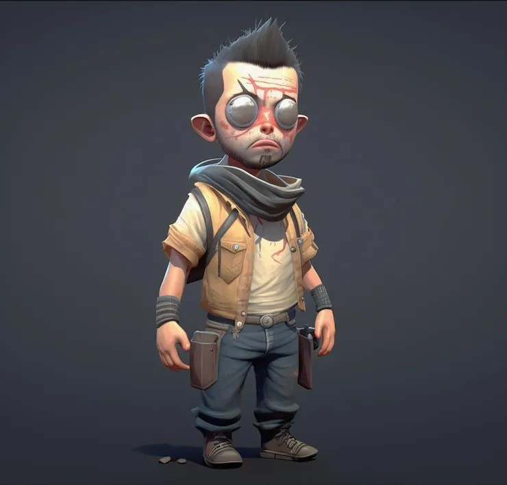
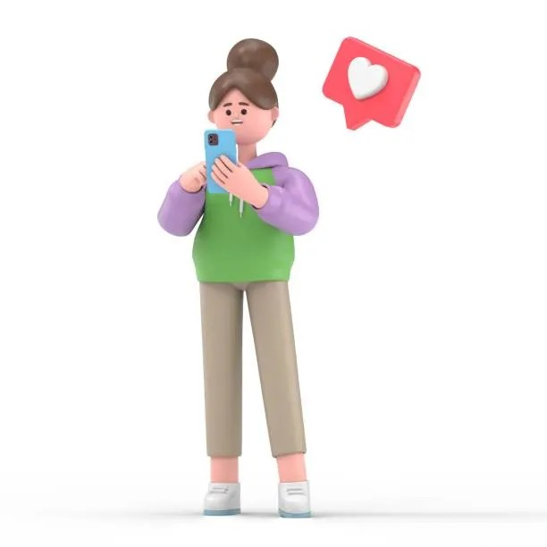

# 👾 8-Bit-O-Matic: The Pixel Art Creator 🎨

Turn any image into a retro, 8-bit style piece of art! This simple web application takes your uploaded images and transforms them into pixelated versions, offering both full-color and classic black & white styles. ✨

---

## 🚀 Live Demo

Check out the live application here:

### 👉 [https://eight-bit-o-matic.onrender.com/](https://eight-bit-o-matic.onrender.com/) 👈

---

## 🌟 Features

-   **🖼️ Easy Image Upload:** Select any image file from your computer.
-   **🎨 Color Pixelation:** Converts your image into a 16-color, pixelated version.
-   **🎬 Black & White Pixelation:** Creates a classic, monochrome pixel art effect.
-   **🚀 Instant Preview:** See your generated 8-bit character immediately on the page.
-   **🕹️ Retro UI:** A fun, 8-bit themed interface.

---
## 🖼️ Project Showcase

Here are some examples of images transformed by the 8-Bit-O-Matic!

### Character Set 1

| Original | Pixelated (Color) | Pixelated (B&W) |
| :------: | :---------------: | :-------------: |
|  | .png) | .png) |

<br>

### Character Set 2

| Original | Pixelated (Color) | Pixelated (B&W) |
| :------: | :---------------: | :-------------: |
|  | .png) | .png) |

## 🛠️ Tech Stack

-   **🐍 Backend:** Python with **Flask**
-   **🖼️ Image Processing:** **Pillow** (Python Imaging Library)
-   **🌐 Frontend:** HTML, CSS, and vanilla JavaScript

---

## 🚀 Setup and Installation

Follow these steps to get the application running on your local machine.

### 1. Prerequisites ✅

Make sure you have **Python 3** and **pip** installed on your system. You can check by running:

```bash
python --version
pip --version
````

### 2\. Get the Project Files 📁

Get the project files onto your machine. You will need two files: `app.py` and `index.html`.

### 3\. Create the Project Structure 🏗️

For Flask to find the HTML file, you must place it in a specific folder structure:

```
your-project-folder/
├── app.py
└── templates/
    └── index.html
```

  - Create a folder for your project.
  - Place `app.py` inside it.
  - Create a sub-folder named `templates`.
  - Place `index.html` inside the `templates` folder.

### 4\. Create a Virtual Environment 🌿 (Recommended)

It's best practice to create a virtual environment to manage project dependencies.

```bash
# Create the virtual environment
python -m venv venv

# Activate it
# On Windows:
venv\Scripts\activate
# On macOS/Linux:
source venv/bin/activate
```

### 5\. Install Dependencies 📦

The project requires `Flask` and `Pillow`. Install them using pip:

```bash
pip install Flask Pillow
```

### 6\. Run the Application ▶️

With your virtual environment active and dependencies installed, run the Flask app:

```bash
python app.py
```

You should see output like this, indicating the server is running:

```
 * Running on [http://127.0.0.1:5000](http://127.0.0.1:5000)
```

Open a web browser and navigate to **http://127.0.0.1:5000** to use the application.

-----

## 🎮 How to Use

1.  Open the application in your browser.
2.  Click the **"Select File..."** button to upload an image.
3.  Once an image is selected, the pixelation buttons will become active.
4.  Click **"Pixelate Color"** for a 16-color version.
5.  Click **"Pixelate B\&W"** for a black and white version.

-----

## 🖼️ How to Add Images to this README

You can add images or GIFs to your README file using Markdown syntax.

**1. Use a URL:**
The easiest way is to use a link to an image hosted online.

```markdown

```

**2. Use a Local File:**
If you have an image in your project folder, you can link to it directly.

  - Create a folder named `images` in your project.
  - Add your image (e.g., `demo.gif`) to that folder.
  - Link to it in your README like this:

<!-- end list -->

```markdown

```

```
```
